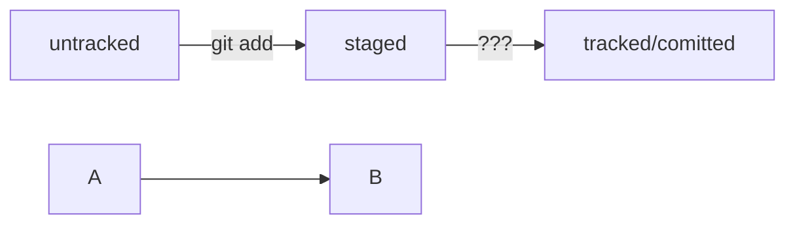

# H1 - заголовок 1го уровня
## H2 - заголовок второго уровня
### H3 - заголовок третьего уровня
#### H4 - четвертого уровня
##### H5 - пятого уровня
###### H6 - шестого уровня


```bash
ls - la
```
```html
<h1>А я просто текст</h1>
``` 

HEAD -- это голова.
Коммит -- это всему голова.
Статусы файлов:





